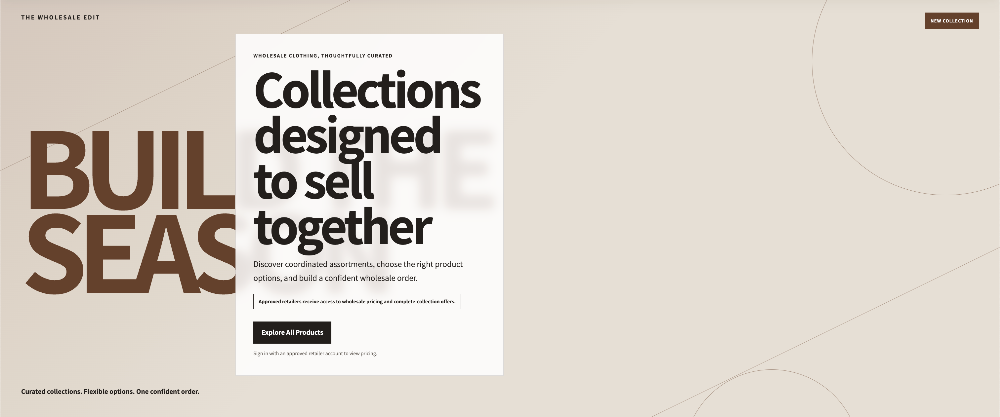
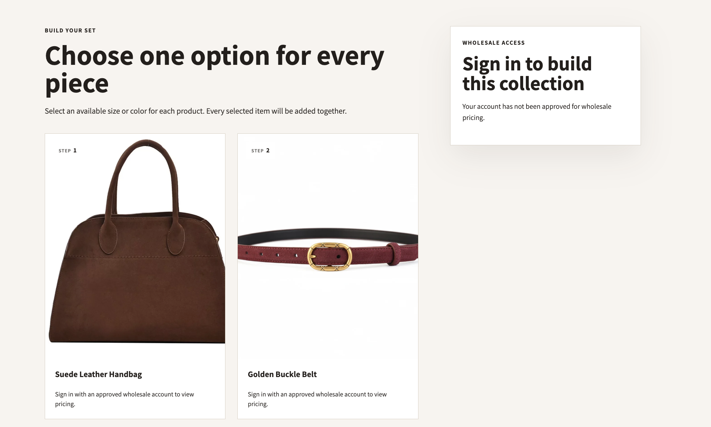
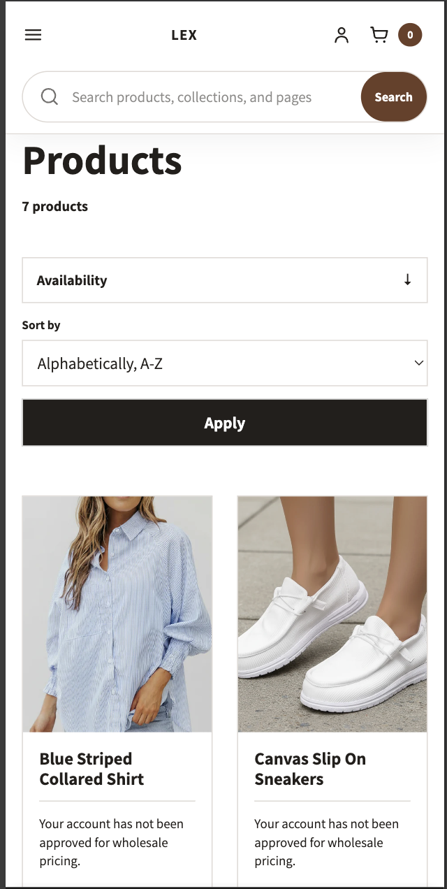

# Lex Wholesale Shopify Theme

A custom Shopify Online Store 2.0 theme built for a wholesale clothing business.

The project creates a business-to-business storefront where approved retailers can view wholesale pricing, purchase individual products, or configure and add a complete coordinated collection to the cart.

> **Project status:** Active portfolio project and theme prototype. Merchant-specific content, policies, discount rules, and final production testing must be completed before a live launch.

## Project Overview

Most Shopify themes are designed primarily for direct-to-consumer stores. This theme explores the additional requirements of a wholesale storefront:

- Restrict wholesale prices to approved customers
- Allow public browsing without exposing pricing
- Support customer approval through Shopify customer tags
- Sell products individually or as coordinated collections
- Make multi-product collection ordering easier
- Give non-technical merchants control through the Shopify Theme Editor

This project also gave me experience applying component-based frontend thinking outside of React and Next.js through Liquid sections, snippets, JSON templates, and reusable CSS and JavaScript modules.

## What This Project Demonstrates

For recruiters and hiring managers, this project demonstrates experience with:

- Translating business requirements into technical features
- Building a Shopify theme from the ground up
- Designing reusable and merchant-configurable components
- Working with customer state, tags, products, variants, collections, carts, and search
- Debugging Liquid syntax and Shopify template-assignment issues
- Building responsive interfaces without a frontend framework
- Separating standard shopping flows from custom bundle flows
- Preserving accessibility, semantic HTML, and SEO fundamentals
- Handling sold-out variants, hidden prices, missing media, mobile navigation, and empty states

## Core Features

### Wholesale Customer Access

Wholesale pricing and purchase controls are available only to signed-in customers with the configured approval tag.

Default approval tag:

```text
wholesale-approved
```

Visitors who are not approved can still browse products and collections, but prices remain hidden.

### Individual Product Ordering

Approved customers can:

- View wholesale prices
- Select product variants
- Add individual products to the cart
- Purchase products through the normal Shopify flow

### Complete Collection Ordering

Curated collections can use an alternate bundle template.

Example:

```text
/collections/travel-collection?view=bundle
```

The bundle page allows a retailer to:

- Review every product in the collection
- Select an available variant for each product
- Choose a collection quantity
- Add the coordinated assortment to the cart in one action

Bundle products receive private cart-line metadata:

```text
_bundle_id
_bundle_handle
_bundle_title
_bundle_component_position
_bundle_component_count
_bundle_quantity_per_product
_bundle_schema_version
```

The normal collection template remains separate from the bundle template so standard collections and `/collections/all` do not inherit bundle behavior.

### Product Discovery

The theme includes:

- Responsive All Products grid
- Availability, vendor, product-type, and variant-option filters
- Sorting and pagination
- Search results page
- Predictive search with product images
- Correct product, collection, article, and page result links

Price filters and price-based sorting are hidden from customers who cannot view wholesale pricing.

### Cart Experience

The cart supports:

- Individual products
- Complete-collection items
- Bundle metadata
- Grouped bundle presentation
- Cart-count updates without a page refresh

The stable implementation uses the normal cart page rather than forcing a modal drawer.

### Merchant-Editable Storefront

The Theme Editor can control:

- Logos and menus
- Colors and typography
- Section spacing
- Promotional images and videos
- Image focal positions
- Homepage content
- Collection promotions
- Testimonials
- FAQ questions
- About-page content
- Newsletter messaging
- Contact links
- Social profiles

## Custom Sections and Templates

### Homepage

- Announcement bar
- Professional e-commerce header
- Predictive search
- Image/video introduction hero
- CSS-generated advertising fallback
- Featured collection promotion
- Testimonials
- Newsletter
- Modern footer

### Commerce Pages

- Product page
- Standard collection page
- Complete-collection bundle page
- All Products page with filters
- Search results page
- Cart page

### Content Pages

- About Us
- FAQ
- Contact-page links
- Wholesale application page planned
- Merchant-managed policy pages

## Technology

- Shopify Liquid
- Shopify Online Store 2.0
- JSON templates
- HTML5
- CSS3
- Vanilla JavaScript
- Shopify Ajax Cart API
- Shopify Predictive Search API
- Shopify customer forms
- Shopify product, variant, collection, and cart objects

No frontend framework or external UI library is required for the storefront.

## Project Structure

```text
lex-wholesale/
├── assets/
│   ├── base.css
│   ├── cart-state.js
│   ├── collection-add-all.js
│   ├── predictive-search.js
│   ├── section-header.css
│   ├── section-footer.css
│   └── ...
├── config/
│   ├── settings_schema.json
│   └── settings_data.json
├── layout/
│   └── theme.liquid
├── sections/
│   ├── header.liquid
│   ├── footer.liquid
│   ├── main-collection.liquid
│   ├── main-bundle-collection.liquid
│   ├── main-all-products.liquid
│   ├── main-about-us.liquid
│   ├── main-faq.liquid
│   └── ...
├── snippets/
│   ├── product-card.liquid
│   ├── bundle-product-selector.liquid
│   ├── header-navigation.liquid
│   ├── footer-menu.liquid
│   └── ...
└── templates/
    ├── collection.json
    ├── collection.bundle.json
    ├── collection.all-products.json
    ├── page.about.json
    ├── page.faq.json
    └── ...
```

The exact file list may change as development continues.

## Key Engineering Decisions

### Separate Standard and Bundle Templates

The standard collection experience and complete-collection experience use different sections, stylesheets, and JSON templates.

This prevents:

- `/collections/all` from showing bundle controls
- Normal collections from inheriting bundle layouts
- Bundle CSS from affecting standard product grids
- Custom cart behavior from leaking into unrelated pages

### Server-Rendered Price Gating

Price visibility is determined through Liquid rather than hidden only with CSS.

```liquid

  Show wholesale price and purchase controls

  Show the approved-account message

```

This keeps restricted prices out of the rendered storefront interface for unapproved visitors.

### Progressive Enhancement

Core navigation, forms, links, FAQ accordions, and footer menus use native HTML behavior wherever possible.

JavaScript is reserved for interactions that require it:

- Predictive search
- Complete-collection cart submission
- Cart-state synchronization
- Bundle grouping

### Theme Editor Flexibility

Sections expose settings for content, media, color, alignment, spacing, layout direction, and optional elements so merchants can manage the storefront without editing Liquid files.

## Notable Problems Solved

### Predictive Search Links

The predictive-search template originally reused `query.url` for every result type. Each resource now links through its own object:

```liquid
{{ product.url }}
{{ collection.url }}
{{ page.url }}
{{ article.url }}
```

### Template Separation

Shopify collection templates required careful separation between:

```text
collection.json
collection.bundle.json
collection.all-products.json
```

This prevented custom bundle behavior from taking over standard collections.

### Liquid Parser Constraints

Complex expressions inside render arguments caused parser errors. The safer pattern is to calculate values first:

```liquid

```

Then pass the variable:

```liquid

```

### Cart UI Stability

A custom cart drawer introduced an overlay that blocked the storefront. The theme was refactored back to a stable cart-page flow while retaining Ajax cart-count updates and bundle metadata.

## Accessibility

Accessibility considerations include:

- Semantic landmarks
- Skip navigation link
- Keyboard-focus styles
- Accessible form labels
- Native `details` and `summary` accordions
- Reduced-motion support
- Descriptive image alt text
- Accessible predictive-search roles
- Clear sold-out and pricing-status messaging
- Mobile-friendly touch targets

A production release should still receive automated and manual accessibility testing.

## SEO Foundations

The theme includes:

- Semantic heading structure
- Crawlable navigation links
- Product and collection URLs
- Metadata and structured-data snippets
- Optional FAQ structured data
- Organization information in the footer
- Responsive images and descriptive alt text
- Internal links between products, collections, FAQ, About, and Contact pages

SEO results still depend on the merchant's final content, product data, page titles, descriptions, policies, and Search Console configuration.

## Local Development

### Requirements

- Shopify Partner or development-store access
- Shopify CLI
- Git
- A Shopify theme development environment

### Authenticate

```bash
shopify auth login
```

### Start the Development Server

```bash
shopify theme dev
```

### Run Theme Check

```bash
shopify theme check
```

To fail on suggestions:

```bash
shopify theme check --fail-level suggestion
```

### Push as a Draft Theme

```bash
shopify theme push --unpublished
```

Review the generated draft theme before publishing it.

## Store Configuration

### Customer Tags

Recommended defaults:

```text
wholesale-approved
wholesale-pending
wholesale-rejected
```

### Search Filters

Configure filters through Shopify Search & Discovery.

Useful options include:

- Availability
- Product type
- Vendor
- Size
- Color
- Other variant options

### Discounts

The theme adds collection products to the cart, but discount rules are configured separately in Shopify Admin or through a Shopify Discount Function/app.

A basic automatic discount can target:

- A specific collection
- A minimum eligible quantity
- A customer segment
- A percentage or fixed amount

A rule requiring exactly one distinct item from every product in a collection may require a custom Discount Function or compatible app.

### Alternate Templates

Examples:

```text
collection.bundle
collection.all-products
page.about
page.faq
```

Alternate templates can be previewed with `?view=` during development.

## Testing Checklist

Before production, test:

- Public browsing
- Signed-out price visibility
- Pending and rejected accounts
- Approved wholesale accounts
- Product variant selection
- Sold-out variants
- Individual add-to-cart
- Complete-collection add-to-cart
- Bundle quantity behavior
- Cart grouping and cart counts
- Search submission and predictive links
- Collection filters, sorting, and pagination
- Account and cart navigation
- Mobile header and footer
- Keyboard navigation
- Reduced-motion behavior
- Contact and newsletter forms
- Policy links
- Checkout and discount behavior
- Chrome, Safari, Firefox, and mobile browsers

## Screenshots






## Planned Improvements

- Wholesale application page and approval workflow
- Automated tests for cart and bundle behavior
- Improved collection-discount validation
- Lighthouse performance audit
- Accessibility audit
- More complete empty and error states
- Merchant documentation
- CI workflow for Shopify Theme Check
- Production error-reporting strategy

## Lessons Learned

This project reinforced that Shopify theme engineering involves more than visual styling.

Key lessons included:

- Understanding Shopify's server-rendered data model
- Designing around customer, product, variant, collection, and cart objects
- Separating merchant configuration from implementation
- Debugging template and section registration issues
- Preserving standard commerce behavior while adding custom workflows
- Building framework-free responsive interfaces
- Treating accessibility and maintainability as part of the feature set

## Author

**Michael Mount**

Frontend and full-stack developer focused on JavaScript, TypeScript, React, Next.js, Node.js, and e-commerce development.

```text
Portfolio: https://michaelmount.vercel.app/
LinkedIn: https://www.linkedin.com/in/mmount98/
GitHub: https://github.com/Michael-Mount
Email: mmount.dev@gmail.com
```

## License

The source code in this repository is available under the MIT License.

Client branding, logos, product photography, product descriptions, trademarks,
and other merchant-provided content are not included in that license and remain
the property of their respective owners.

Copyright (c) 2026 Michael Mount
